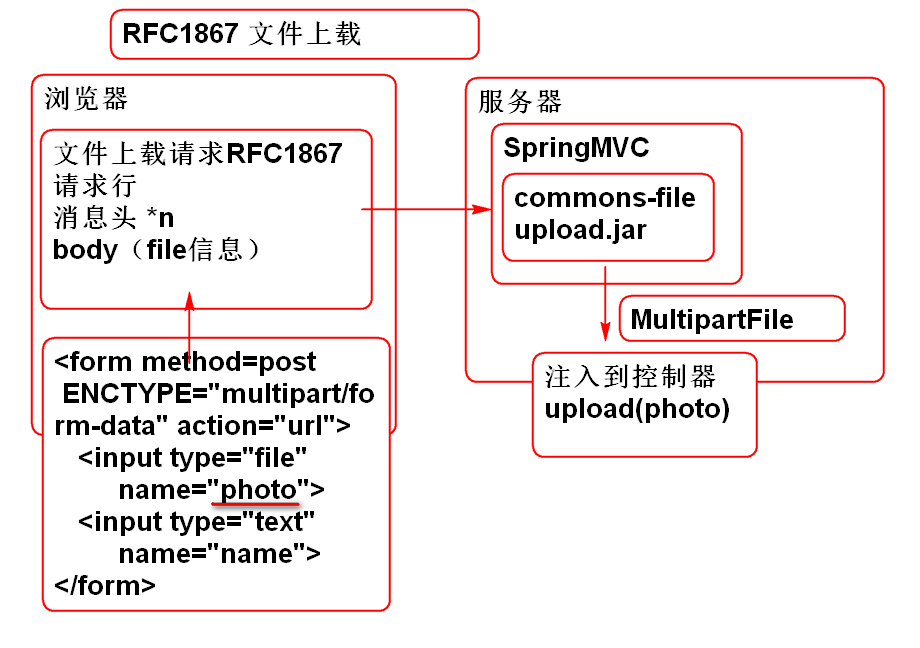

### 文件上载

文件上载标准 RFC1867 [http://doc.tedu.cn/rfc/rfc1867.txt](http://doc.tedu.cn/rfc/rfc1867.txt "RFC1867")

Spring MVC 利用 Apache commons-fileupload API 支持了文件上载

参考： [http://doc.tedu.cn/spring-framework-3.2.8/spring-framework-reference/html/mvc.html#mvc-multipart](http://doc.tedu.cn/spring-framework-3.2.8/spring-framework-reference/html/mvc.html#mvc-multipart "17.10 Spring's multipart (file upload) support")

1. 创建包含文件上载的页面 index.html
	
		<form action="user/upload.do" 
			method="post" 
			enctype="multipart/form-data">
			
			照片：<input type="file" name="photo"> 
			姓名：<input type="text" name="name"> 
			<input type="submit" value="提交">  
		
		</form>	

2. 导入上载组件

		<dependency>
		  <groupId>commons-fileupload</groupId>
		  <artifactId>commons-fileupload</artifactId>
		  <version>1.3.1</version>
		</dependency>

3. 配置Spring 文件上载解析器 spring-web.xml:

		<!-- 配置文件上载解析器组件 -->
		<bean id="multipartResolver"
			class="org.springframework.web.multipart.commons.CommonsMultipartResolver">
		    <!-- one of the properties available; the maximum file size in bytes -->
		    <property name="maxUploadSize" value="5000000"/>
		</bean>
		 
4. 编写控制器处理文件上载请求 UserController

		@RequestMapping(value="/upload.do",
				method=RequestMethod.POST)
		@ResponseBody
		public String upload(
			MultipartFile photo,
			String name) throws IOException{
			
			//MultipartFile 是Spring提供了API
			//封装了上载数据的信息：原始文件名，
			//文件的类型（mime ContentType）
			//文件的数据：byte[] 或者 输入流
			//上载时控件 name 属性的值
			
			//获取原始文件名
			String filename=
				photo.getOriginalFilename();
			//获取文件类型
			String type=
				photo.getContentType();
			//文件的数据
			byte[] data=
				photo.getBytes();
			
			File file = new File("d:/", filename);
			FileOutputStream out= 
				new FileOutputStream(file);
			out.write(data);
			out.close();
			
			return name+"Success!";
		}	