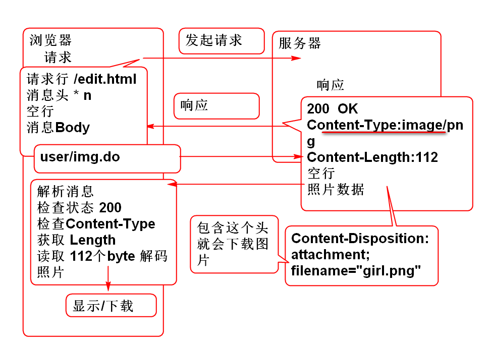

## 文件下载

HTTP协议提供了文件下载功能： RFC2616 19.5.1

> 只需要在Spring MVC 控制器中设置适当的响应头就可以实现下载文件功能

### 直接显示图片

1. 编写网页显示图片 index.html

		<h1>显示自定义照片</h1>
		
		<a href="user/img.do">显示照片</a>

2. 编写控制器，发送图片 UserController

		//produces="image/png" 用于设置 ContentType 头
		@RequestMapping(value="/img.do", 
				produces="image/png")
		@ResponseBody
		public byte[] img() throws IOException{
			//@ResponseBody 自动处理返回值
			//如果是Java Bean 处理为JSON
			//如果byte[] 就将byte数填充到返回
			//返回消息的 body中。
			//new 个照片发回去
			BufferedImage img=new BufferedImage(
				200, 56, 
				BufferedImage.TYPE_3BYTE_BGR);
			//将 img 进行编码 为 png 格式
			//FileOutputStream out = new ...;
			ByteArrayOutputStream out = 
					new ByteArrayOutputStream();
			ImageIO.write(img, "png", out);
			//拿到数组
			byte[] png=out.toByteArray();
			return png;
		}

3. 测试，在网页中点击链接可以显示图片

### 下载图片

只需要设置 Content-Disposition 头可以实现下载文件功能.

1. 编写网页 添加下载链接：
	
		<a href="user/img2.do">下载照片</a>

2. 编写控制器方法，UserController

		@RequestMapping(value="/img2.do", 
				produces="image/png")
		@ResponseBody
		public byte[] img2( 
			HttpServletResponse res)
			throws IOException {
			
			//设置 Content-Disposition 头，可以实现
			//下载文件功能，请参考 RFC2616 19.5.1章节
			// http://doc.tedu.cn/rfc/rfc2616.txt
			
			res.addHeader("Content-Disposition",
				"attachment; filename=\"girl.png\"");
			BufferedImage img=
				new BufferedImage(100, 50, 
				BufferedImage.TYPE_3BYTE_BGR);
			ByteArrayOutputStream out=
				new ByteArrayOutputStream();
			ImageIO.write(img,"png", out);
			byte[] png=out.toByteArray();
			return png;
		}