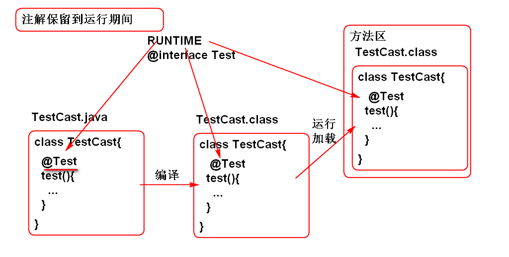

# 反射

是Java API

## 什么是反射

反射是Java提供的动态执行API, 能够动态加载类, 动态创建对象, 动态访问属性, 动态调用方法 ...

## 静态执行与动态执行

静态执行: 经过编译以后, 就确定了程序执行次序, 运行期间按照既定次序执行. 

如:

	Foo foo = new Foo();
	int n = foo.times;
	System.out.println(n);

动态执行: 在"运行期间"才能确定加载那个类,创建那个对象,执行方法 ... 

利用 反射API可以实现动态执行.

### 动态加载类

API
	Class cls = Class.forName("类名");

	//如下两个方法可以获取 cls 对象, 但是不能体现动态特性
	Class cls = Foo.class;
	Class cls = foo.getClass();

案例:

	Scanner in = new Scanner(System.in);
	System.out.print("输入类名:");
	String className=in.nextLine();
	Class cls = Class.forName(className);
	System.out.println(cls);

原理:

	

### 动态创建对象

在运行期间, 根据任意的类名创建对象.

API
	
	Object obj = cls.newInstance()

> 提示: 利用类的无参数构造器创建对象, 反射的"构造器API" 可以调用有参数构造器创建对象.

举个栗子:

	Scanner in = new Scanner(System.in);
	System.out.print("输入类名:");
	String className=in.nextLine();
	Class cls = Class.forName(className);
	System.out.println(cls);
	Object obj = cls.newInstance();
	System.out.println(obj);

### 动态访问属性

使用步骤:

1. 根据属性名找到"属性声明"信息Field
	- Field fld=cls.getDeclaredField(属性名)  //age 属性声明
2. 属性的值在"对象"上, 找到/创建一个对象
3. 在对象当获取属性的值
	- Object val = fld.get(对象)  //age的值

案例:

		Scanner in = new Scanner(System.in);
		System.out.print("输入类名:");
		String className=in.nextLine();
		Class cls = Class.forName(className);
		System.out.println(cls);
		Object obj = cls.newInstance();
		System.out.println(obj);
		
		//找到属性声明信息
		System.out.print("属性名:");
		String name = in.nextLine();
		//动态找到属性声明信息
		Field fld = cls.getDeclaredField(name);
		System.out.println(fld); 
		//读取对象的属性: 在一个对象上读取属性的值
		
		//打开访问权限
		fld.setAccessible(true);
		
		Object val = fld.get(obj);
		System.out.println(val); 

### 反射API可以 "未卜先知"

经典面试题: 

	Eclipse的热键菜单, 用什么技术实现.

### 反射可以动态获取类的信息

反射全部的属性:

	Field[]	getDeclaredFields() 

反射全部的属性:

	Method[]	getDeclaredMethods() 

案例:
		Scanner in = new Scanner(System.in);
		System.out.print("输入类名:");
		String className=in.nextLine();
		Class cls = Class.forName(className);

		//反射类的全部属性
		Field[] fields=
			cls.getDeclaredFields();
		for (Field field : fields) {
			System.out.println(field);
		}
		//反射类的全部方法
		Method[] methods=
			cls.getDeclaredMethods();
		for (Method method : methods) {
			System.out.println(method); 
		}

### 反射可以访问私有属性和方法!!

在访问private 成员之前使用

	e.setAccessible(true); 

可以打开访问权限了

案例:

		//打开访问权限
		fld.setAccessible(true);
		
		Object val = fld.get(obj);
		System.out.println(val); 

面试题目:

	1. Spring 如果给private属性注入值
	2. 如果访问类的私有成员

### 动态访问方法(反射调用方法)

步骤

1. 找到方法的"声明"信息 Method
	- Method	 getDeclaredMethod(方法名, 参数类型...) 
	- Method	 getDeclaredMethod(方法名)
	
		Method m1=cls.getDeclaredMethod("test")
		Method m2=cls.getDeclaredMethod("test", int.class, String.class);
 
2. 创建或得到对象
3. 在对象上调用响应方法!
	- Object method.invoke(对象, 参数...)

		Object v = m1.invoke(对象);
		Object v = m2.invoke(对象, 5, "666");

案例:

		Scanner in = new Scanner(System.in);
		//动态加载类
		System.out.print("输入类名:");
		String className=in.nextLine();
		Class cls = Class.forName(className);
		System.out.println(cls);
		
		//动态创建对象
		Object obj = cls.newInstance();
		System.out.println(obj);
		
		//动态找到一个方法
		System.out.print("方法名:");
		String name=in.nextLine();
		Method m=cls.getDeclaredMethod(name);
		System.out.println(m); 
		
		//动态执行方法
		m.setAccessible(true);//访问私有
		Object val = m.invoke(obj);
		System.out.println(val);

## 框架底层基本都是反射技术实现的

## 注解是利用反射进行解析的!	

原理:

	

案例:

	@Retention(RetentionPolicy.RUNTIME)
	public @interface Test {
	
	}

	public class TestCase {
		
		@Test
		public void demo(){
			System.out.println("demo");
		}
	
		@Test
		public void test(){
			System.out.println("test");
		}
	}
		

	public class Demo03 {
	
		public static void main(String[] args) 
			throws Exception{
			//JUnit 4 原型
			Scanner in = new Scanner(System.in);
			System.out.print("类名:");
			String className = in.nextLine();
			//Class 是反射的入口
			Class cls = Class.forName(className);
			//找到类中全部的方法
			Method[] methods = 
				cls.getDeclaredMethods();
			Object obj = cls.newInstance();
			
			for (Method method : methods) {
				//动态解析注解
				Object a = method
					.getAnnotation(Test.class);
				System.out.println(a); 
				if(a!=null){
					method.invoke(obj);
				}
			}
		}
	
	}

