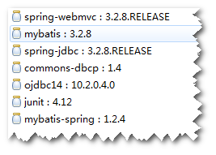
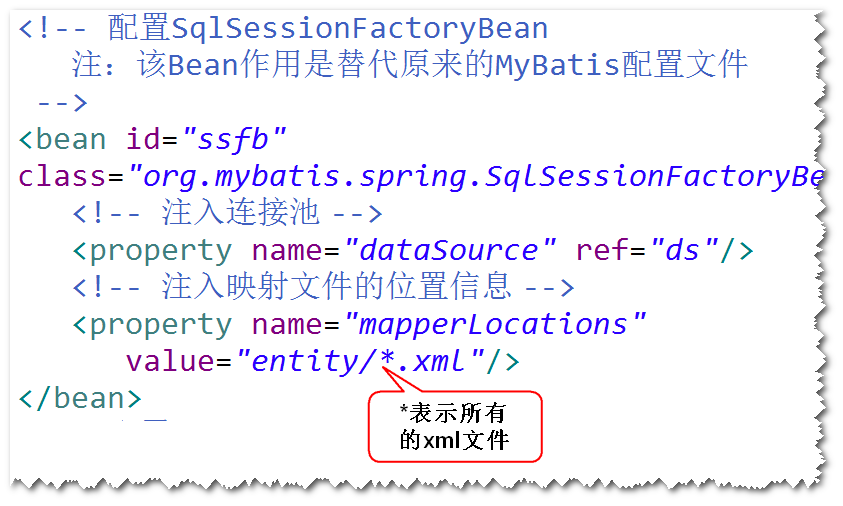
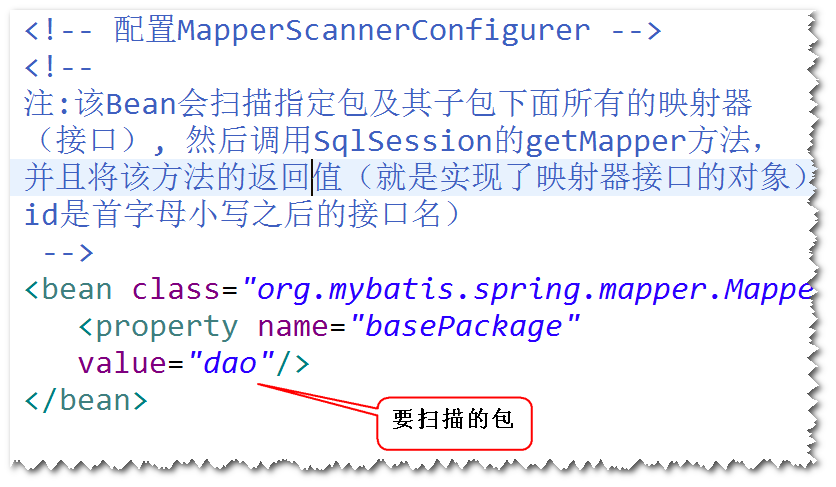
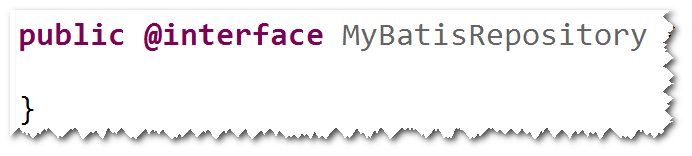
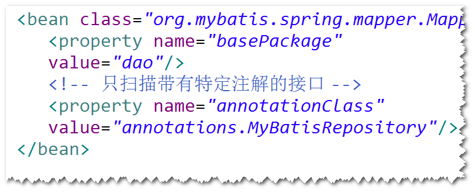
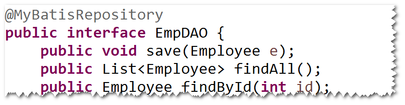
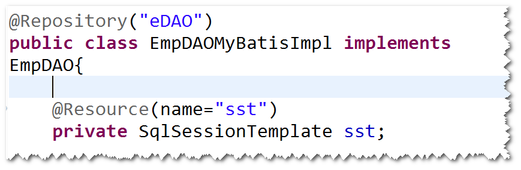
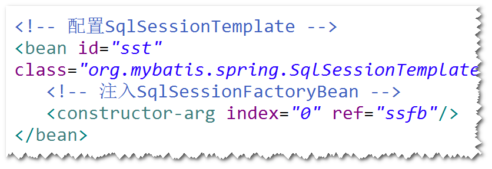

# 1. Mapper映射器
## (1)什么是Mapper映射器?
符合映射文件要求的接口。 
注：MyBatis会生成符合映射器要求的对象。 
## (2)如何写Mapper映射器?
a. 方法名必须与sqlId一样。 
b. 参数类型必须与parameterType一样。 
c. 返回类型必须与resultType一样。 
d. 映射文件的namespace必须等于映射器完整的名字。 
## (3)如何使用Mapper映射器?
比如: 
	EmpDAO dao = SqlSession.getMapper(EmpDAO.class);

# 2. Spring集成MyBatis
## (1)集成方式一
step1. 导包。 
spring-webmvc,mybatis,mybatis-spring,
dbcp,ojdbc,spring-jdbc,junit

step2.添加Spring配置文件。 
注：不再需要MyBatis配置文件，原来配置文件的内容
放到SqlSessionFactoryBean。 

step3.实体类  
step4.映射文件  
step5.Mapper映射器  
step6.配置MapperScannerConfigurer。 
注1: 
该Bean会扫描指定包及其子包下面所有的映射器（接口）,
然后调用SqlSession的getMapper方法，并且将该方法的返回
值（就是实现了映射器接口的对象）放到Spring容器里面（默认的
id是首字母小写之后的接口名,也可以使用@Repository修改默认的
id）。 

注2: 
	只扫描带有特定注解的接口: 
step1. 开发一个注解。 

step2. 修改MapperScannerConfigurer的配置。 

step3. 将该注解添加到接口之上。 

## (2)集成方式二 (了解)
step1. 导包。 
spring-webmvc,mybatis,mybatis-spring,
dbcp,ojdbc,spring-jdbc,junit

step2.添加Spring配置文件。 
注：不再需要MyBatis配置文件，原来配置文件的内容
放到SqlSessionFactoryBean。 

step3.实体类  
step4.映射文件  
step5.Mapper映射器  
step6.写一个java类，实现映射器接口。 

step7.配置SqlSessionTemplate。 
注：SqlSessionTempate对SqlSession的操作做了封装。 

