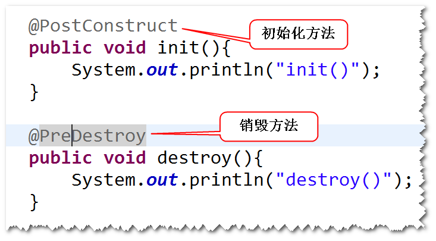

#１.利用注解简化配置
##(1)什么是组件扫描?
- Spring容器在启动之后，会扫描指定的包及其子包下面所有的类， 
- 如果类前面有一些特定的注解（比如 @Component）,
- 则容器会将这个 类纳入容器进行管理（相当于以前在配置文件当中有一个bean元素）。 

##(2)如何进行组件扫描?
- step1. 在类前面添加一些特定的注解，比如 @Component。
-  
-  
- step2. 在配置文件当中，配置组件扫描。
-  

##(3)自动扫描的注解标记
-  