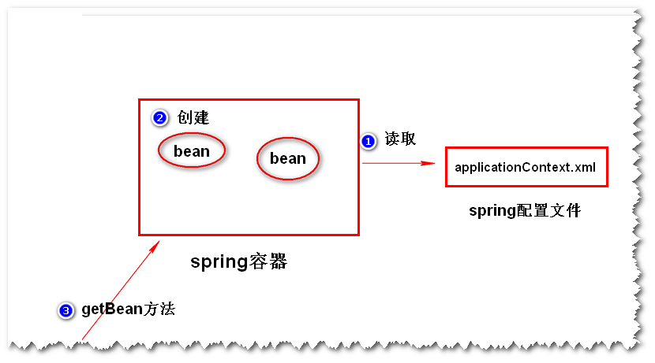
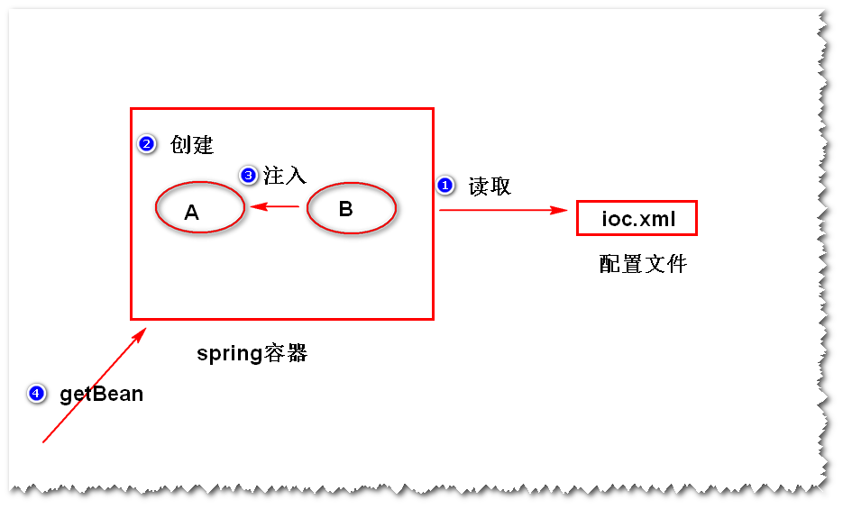
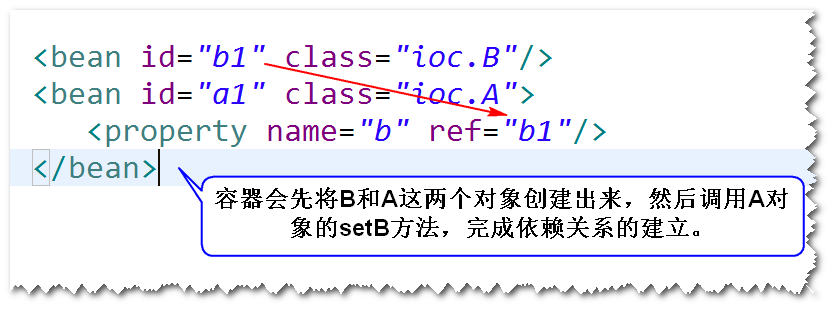

#1. Spring是什么? 
- 是一个轻量级的、开源的用来简化企业级应用开发的框架。

##特点:

- (1)简化开发: Spring框架对常用的api做了简化 
（比如，直接使用jdbc访问数据库， 需要写很多重复性的代码，而使用SpringJdbc，则不需要写这些重复 性的代码了）。

- (2)管理对象: Spring框架提供了一个容器，帮我们管理对象之间的依赖关系。这样 一来，对象之间的耦合度大大降低，方便代码的维护。

- (3)集成其它框架： Spring可以集成其它的一些小的框架（比如用于任务调度的Quartz）。 

----------

#2. Spring容器
##(1)Spring容器是什么?  
Spring框架当中的一个核心模块，用来管理对象。   

----------

##(2)如何启动Spring容器?  
step1. 导包。  
step2. 添加一个配置文件。  
step3. 启动Spring容器。

----------

##(3).如何创建对象?

###方式一 使用无参构造器。

- step1. 给类添加无参构造器（或者缺省构造器）。
- step2. 在配置文件当中，添加一个bean元素。
- step3. 启动容器，调用容器提供的getBean方法。
- 注：被Spring容器所管理的对象，称之为一个bean。  
- 
例：

[点击查看](demo/CreateSpring/CreateSpring.html)
###方式二 使用静态工厂方法。(了解)
- 
例：

[点击查看](demo/CreateSpring/CreateSpring.html)
###方式三 使用实例工厂方法。(了解)
- 
例：

[点击查看](demo/CreateSpring/CreateSpring.html)

----------

##(4)生命周期
###初始化方法 (分配资源)

- a.容器在创建好对象之后，会立即调用初始化方法。
- b.使用init-method属性指定初始化方法名。

###销毁方法 （释放资源）

- a.容器在关闭之前，会销毁它所管理的对象,此时，会调用 销毁方法。
- b.使用destroy-method属性指定销毁方法。
- 
注：销毁方法只有在作用域为单例时有效。

----------

##(5)作用域
- a. 默认情况下，对于一个bean的配置，容器只会创建一个实例。
- b. 如果指定scope属性值为"prototype",则容器会创建多个实例。

----------
#3. IOC (Inversion Of Controll) 控制反转
##(1)什么是IOC ?
- 对象之间的依赖关系由容器来管理（或者说由容器来创建）。

##(2)什么是DI ? (Dependency Injection) 依赖注入
- 容器通过调用set方法或者构造器来建立对象之间的依赖关系。
- 注：
- IOC是目标，DI是手段。

##(3)set方法注入
- step1. Class:A中添加相应的set方法。

- step2. 使用property元素配置set方法注入

- 
例：

[点击查看](demo/DIDemo/DIDemo.html)