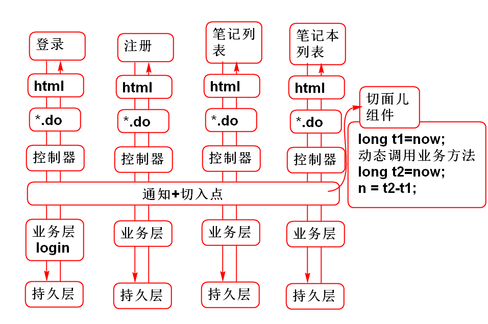
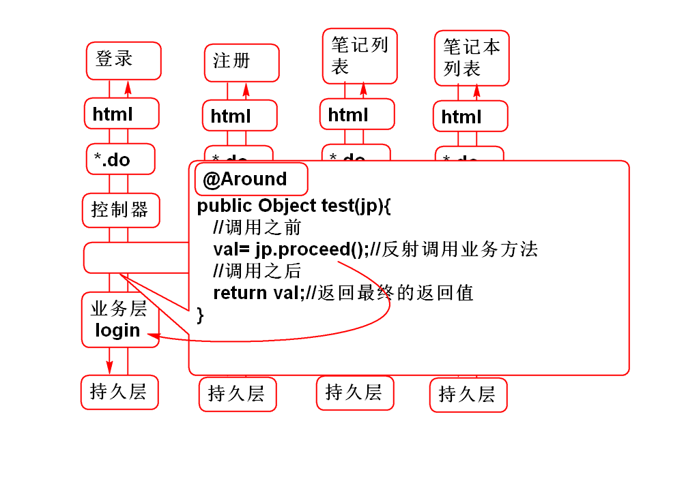
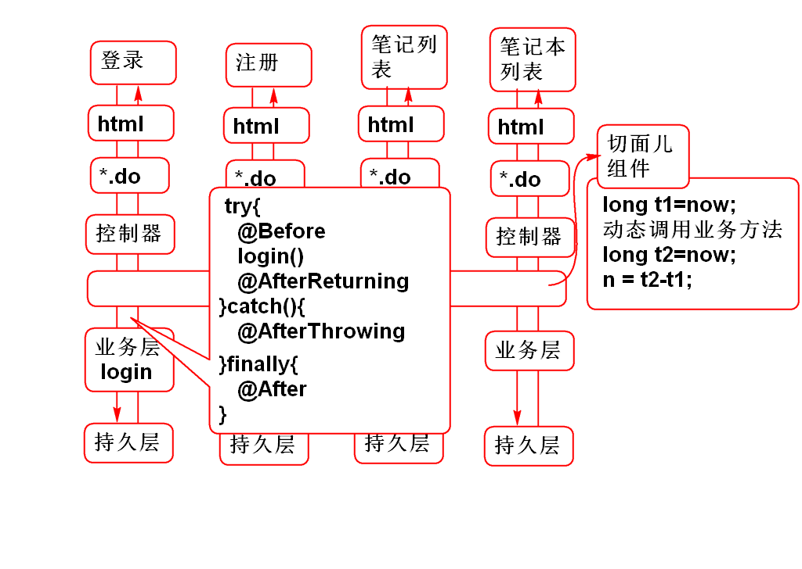

#一、AOP面向切面编程
- 面向切面（儿）编程：也称为横截面编程，类似于过滤器和拦截器过滤器和拦截器用于处理Web请求的“横截面拦截”编程。
- AOP优点：在不改变原有业务情况下，为软件灵活扩展横向功能。

- 性能测试：测试软件的性能，为系统优化提供依据。

- Spring 提供了AOP，其底层是AspectJ(面向方向编程)，AspectJ的底层是“反射包中的动态代理”或者CGLIB动态代理

- 简单的说：Spring AOP是利用“动态代理”实现的。

----------
#二、编写一个AOP

1.导入AspectJ

	<dependency>
	  <groupId>org.aspectj</groupId>
	  <artifactId>aspectjweaver</artifactId>
	  <version>1.8.0</version>
	</dependency>
	<dependency>
	  <groupId>org.aspectj</groupId>
	  <artifactId>aspectjtools</artifactId>
	  <version>1.8.0</version>
	</dependency>
	<dependency>
	  <groupId>org.aspectj</groupId>
	  <artifactId>aspectjrt</artifactId>
	  <version>1.8.0</version>
	</dependency>

2.创建切面组件

	@Component
	@Aspect //切面儿
	public class DemoAspect {
	
	    //声明通知和切入点：在login方法之前插入Hello World 
	    //@Before: 通知, 切入点：bean(userService)
	    // 在userService的全部方法之前执行 test
	    @Before("bean(userService)")
	    public void test(){
	        System.out.println("Hello World!"); 
	    }
	}

- 其中 @Aspect 和 @Before 来自Aspect的包。 切面组件也是Bean，需要使用@Component 和配置组件扫描

3.添加配置文件 spring-aop.xml:

	<!-- spring-aop.xml -->
	<context:component-scan 
	    base-package="cn.tedu.note.aop"/>
	<!-- 如下配置的作用是启动 @Aspect 注解 -->
	<aop:aspectj-autoproxy/>

三、AOP图解

