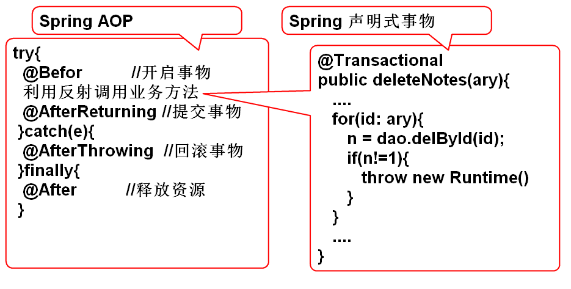
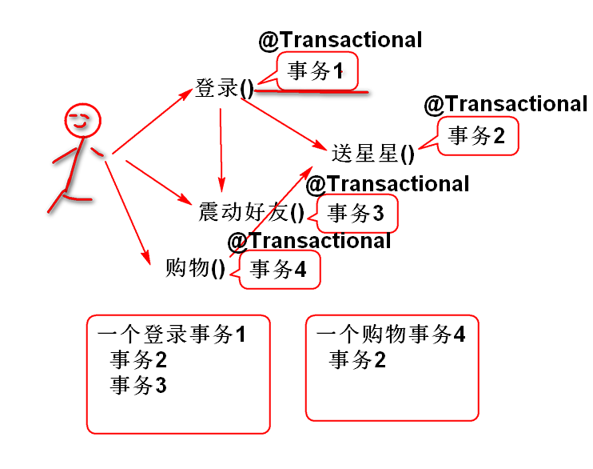
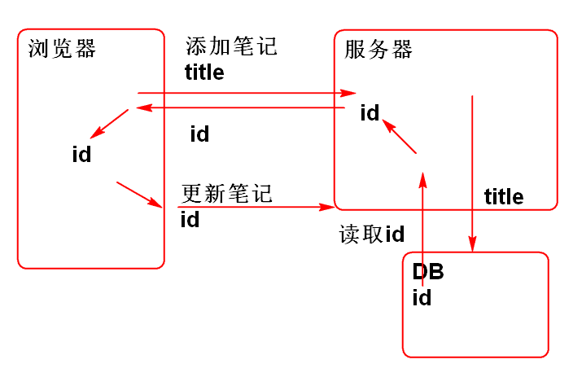
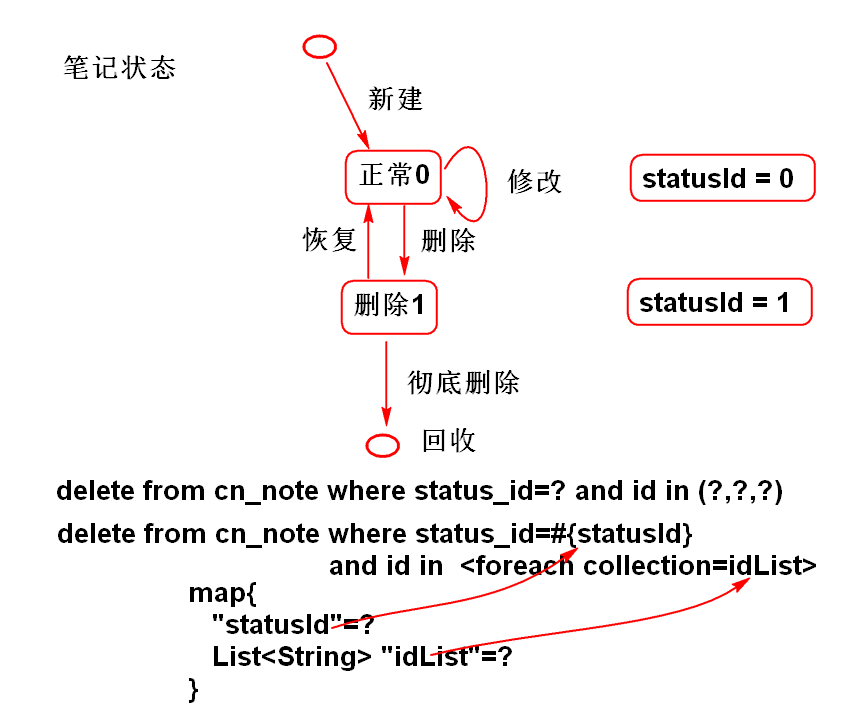
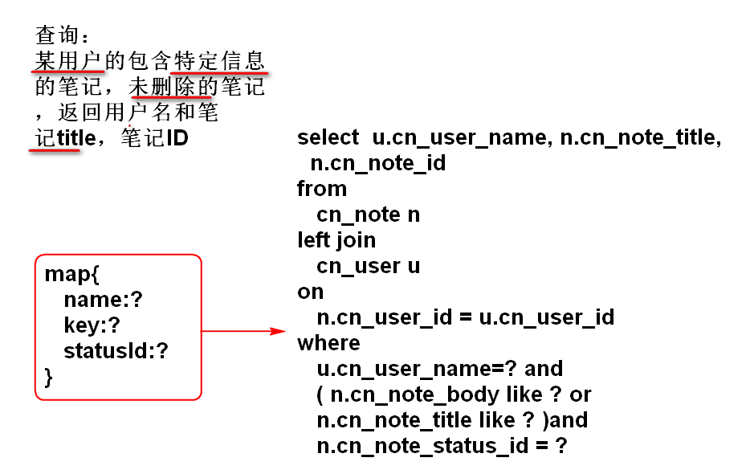

# 云笔记

## AOP

横截面拦截编程

### 切入点表达式

	@通知(切入点表达式)
	@Around("bean(userService)")	

切入点表达式

1. 类级别
			
		within(cn.tedu.note.service.impl.UserServiceImpl)
		within(cn.tedu.note.service.impl.*Impl)

2. bean对象级别

		bean(userService)
		bean(userService) || bean(noteService)
		bean(*Service) 

3. 方法级别

		execution(* cn.tedu.note.service.UserService.login(..))
		execution(* cn.tedu.note.service.UserService.*(..))
		execution(* cn.tedu.note.service.*Service.*(..))
		execution(* cn.tedu.*.service.*Service.*(..))

> 建议: 在软件中将包名，类名，方法名定义的有规律，便于使用“切入点”表达的书写。

### AOP 的工作原理

1. 注解如何解析：利用反射解析注解
2. Spring AOP是利用 AspectJ 实现的
3. AOP底层利用了动态代理技术
	- 如果被代理的位置有接口，则使用JDK动态代理（必须有接口）
	- 如果被代理的位置没有接口，则使用CGLIB动态代理
 
	> 建议AOP切入到有接口的位置，自动调用JDK动态代理。

4. JDK动态代理是反射API的一部分
	- java.lang.reflect.Proxy
5. 代理模式：不改变原有类功能，为类的方法扩展功能。

## 单例模式

> 模式: 	解决特定问题的固定编程套路，是无需思考的固定思路。

单例模式：解决“单例问题”的固定编程套路。

单例：在程序运行期间类只能有一个实例。

案例：
	
	public class Demo {
		public static void main(String[] args) {
			//Girl friend = new Girl();
			//Girl friend2 = new Girl();
			//Girl g = Girl.girl;
			//Girl.girl = null;
			Girl g = Girl.getGirl();
			Girl g1 = Girl.getGirl();
		}
	}
	//饿汉式（立即式）
	class Girl{
		//....
		private static Girl girl = new Girl();
		private Girl() {
			//...
		}
		public static Girl getGirl() {
			return girl;
		}
	}
	//懒惰式(懒汉式)
	class Boy{
		//....
		private static Boy boy;
		private Boy() {
			//...
		}
		public synchronized static Boy getBoy() {
			if(boy==null){
				boy = new Boy();
			}
			return boy;
		}
	}

> 单例，单例模式 区别? 

JDK使用的模式： 

- 流：装饰器模式
- 线程，Servlet： 模板模式
- 迭代器，ResultSet：迭代器模式
- 监听器，Swing：观察者模式 

## Spring 事物处理

保证一个业务操作的完整完成，避免其他业务过程的干扰。

编程式事物处理：
	
	//建立连接
	conn = ...
	try{
		//开始事物                     @Befor
		conn.setAutocomit(false);
		业务操作 过程
		select ...
		insert ... //可能发生异常
		update ... //钱不够，异常
		delete ...
		//提交事物
		conn.commit();                 @AfterReturning
	}catch(e){
		//回滚事物 
		conn.rollback();               @AfterThrowing
	}finally{
		//释放资源
		conn.close();                  @After
	}

Spring 利用AOP，实现了声明式事物管理： 

	try{                               //业务方法
		@Befor          //开启事物     @Transactional
		利用反射调用业务方法  --------> updateNote(){....}
		@AfterReturning //提交事物
	}catch(e){
		@AfterThrowing  //回滚事物
	}finally{
		@After          //释放资源
	}

案例:

1. 配置事务管理器 spring-mybatis.xml:

		<!-- 配置事务管理器：基于dataSource的事务管理器 -->
		<bean id="txMgr"			class="org.springframework.jdbc.datasource.DataSourceTransactionManager">
			<property name="dataSource"	ref="dataSource"></property>
		</bean>
		<!-- 用于驱动 @Transactional 注解 -->
		<tx:annotation-driven transaction-manager="txMgr"/>

2. 持久层方法， NoteDao:

		int deleteNote(String id);

3. 添加SQL NoteMapper.xml:

		<delete id="deleteNote"
			parameterType="string">
			delete from
				cn_note
			where 
				cn_note_id=#{id}
		</delete>	

4. 业务层方法 NoteService:

		int deleteNotes(String... ids);

5. 实现业务层方法
	
		@Transactional
		public int deleteNotes(String... ids) {
			//String... 就是 String[] 
			for(String id: ids){
				int n = noteDao.deleteNote(id);
				if(n!=1){
					throw new NoteNotFoundException(id);
				}
			}
			return ids.length;
		}

	> 业务层方法中使用 @Transactional 这样方法就自动支持事务了，当方法抛出 RuntimeException（含子类）时候，方法中的操作就会自动回滚。
	> String... 是编程参数，本质上就是字符串数组 String[]	

6. 测试 NoteServiceTestCase：

		@Test
		public void testDeleteNotes(){
			String id1="5565bda4-ddee-4f87-844e-2ba83aa4925f";
			String id2="9187ffd3-4c1e-4768-9f2f-c600e835b823";
			String id3="fed920a0-573c-46c8-ae4e-368397846efd";
			String id4="ebd65da6-3f90-45f9-b045-782928a5e2c0";
			// String... 变长参数，编译过后是 
			// new String[]{id1,id2,id3,id4}
			// String... 只能用于最后一个参数
			int n = service.deleteNotes(
				id1, id2, id3, id4);
			System.out.println(n); 
		}
		
	> 测试结果：当传入方法的ID包含错误时候，会发生事务回滚，回退到没有删除的状态，如果传入方法的ID都是正确的时候，方法才能正确执行提交事务删除数据。

### 云笔记事务

在全部的业务层方法上使用 @Transactional 使项目支持事务。

### 事务属性（了解）

只读属性：@Transactional( readOnly=true ) 说明当前事务方法执行期间只进行数据库读取操作，不对数据库进行写操作（insert, update, delete）使用这个属性可以提供只读方法的性能。

事务隔离属性： 

- isolation=Isolation.DEFAULT
- isolation=Isolation.READ_UNCOMMITTED  最低隔离，不推荐
- isolation=Isolation.READ_COMMITTED    常见各级基本，就是DEFAULT
- isolation=Isolation.REPEATABLE_READ   可以重复读取
- isolation=Isolation.SERIALIZABLE      完全串型操作

> 绝大多数情况下使用默认的 READ_COMMITTED

事务传播问题：

传播属性:

1. Propagation.REQUIRED 如果有事务,参与到当前事务, 如果没有就开启新事务. 
	- 默认的传播属性,
	- 最常用的属性,
	- 默认值!
2. Propagation.REQUIRES_NEW, 必须创建新事务, 如果当前有事务, 则当前事务挂起, 开启新事务.
3. Propagation.NEVER,  绝不, 方法从不参与事务.
4. Propagation.NESTED, 嵌套, 事务必须嵌套到其他事务中
5. Propagation.MANDATORY 不能参与事务
6. Propagation.NOT_SUPPORTED, 不支持, 可以在事务中调用, 但是不参与不支持事务. 调用时候出现异常。
7. Propagation.SUPPORTS 支持事务, 可以在事务中调用, 但是单独调用, 没有事务保护.

> 绝大多数使用： REQUIRED

## MyBatis 复杂SQL问题

### 自增类型Key

MySQL SQLServer DB2 等数据库提供了自增类型

Oracle 中没有自增类型类型，Oracle提供了类似的Sequence

MySQL：
	
	create table person
	(
	   person_id int not null auto_increment,
	   person_name varchar(50),
	   person_age int,
	   primary key (person_id)
	);
	
自增类型会自动填写，无需插入值

	insert into person (person_id, person_name, person_age)
		values(null, 'Tom', 10);

	insert into person ( person_name, person_age)
		values( 'Tom', 10);

为什么需要读取自增ID的值：

MyBatis 支持了自增类型：

1. 创建数据库表

		create table person
		(
		   person_id int not null auto_increment,
		   person_name varchar(50),
		   person_age int,
		   primary key (person_id)
		);

2. 创建实体类：

		public class Person implements Serializable{
			private static final long serialVersionUID = 7033415472221675294L;
		
			private Integer id;
			private String name;
			private Integer age;
			
			public Person() {
			}
		
			public Person(String name, Integer age) {
				this.name = name;
				this.age = age;
			}
		
			public Integer getId() {
				return id;
			}
		
			public void setId(Integer id) {
				this.id = id;
			}
		
			public String getName() {
				return name;
			}
		
			public void setName(String name) {
				this.name = name;
			}
		
			public Integer getAge() {
				return age;
			}
		
			public void setAge(Integer age) {
				this.age = age;
			}
		
			@Override
			public String toString() {
				return "Person [id=" + id + ", name=" + name + ", age=" + age + "]";
			}
		
			@Override
			public int hashCode() {
				final int prime = 31;
				int result = 1;
				result = prime * result + ((id == null) ? 0 : id.hashCode());
				return result;
			}
		
			@Override
			public boolean equals(Object obj) {
				if (this == obj)
					return true;
				if (obj == null)
					return false;
				if (getClass() != obj.getClass())
					return false;
				Person other = (Person) obj;
				if (id == null) {
					if (other.id != null)
						return false;
				} else if (!id.equals(other.id))
					return false;
				return true;
			}
		}

3. 创建持久层接口:
	
	public interface PersonDao {
		int addPerson(Person person);
	}

4. 声明SQL， PersonMapper.xml:
	
		<mapper namespace="cn.tedu.note.dao.PersonDao">
			<!-- useGeneratedKeys 用于支持自增类型，
			可以在插入数据以后读取自动增加的ID 
			keyProperty="id" 用于指定那个Bean属性是
			自增类型，Person 类包含属性 ID，属性的值
			会自动的填充为数据库生成的新ID-->
			<insert id="addPerson"
				useGeneratedKeys="true"
				parameterType="cn.tedu.note.entity.Person"
				keyProperty="id">
				insert into person(
					person_id,
					person_name,
					person_age
				) values (
					null,
					#{name},
					#{age}
				)
			</insert>
		</mapper>

5. 测试 

		public class PersonDaoTestCase 
			extends BaseTestCase{
		
			PersonDao dao;
			
			@Before
			public void initDao(){
				dao = ctx.getBean(
					"personDao",PersonDao.class);
			}
			
			@Test
			public void testAddPerson(){
				Person person = 
					new Person("李洪鹤", 30);
				System.out.println(person);//id=null
				//myBatis在添加对象时候，自动的读取自增
				//类型的ID值，填充到person的id属性
				int n = dao.addPerson(person);//id=3
				System.out.println(person); 
				System.out.println(n); 
			}
		}

## MyBatis 动态SQL

MyBatis 的配置文件支持动态SQL

- `<if>`  单路分支
- `<choose> <when>` 多路分支
- `<trim>` 去掉多余的 ， and  or
- `<foreach>`

> 如上标签可以与任何的SQL进行拼接

批量删除可以使用foreach

	delete from cn_note where cn_note_id=?
	delete from cn_note where cn_note_id=?
	delete from cn_note where cn_note_id=?
	delete from cn_note where cn_note_id=?

替换为：

	delete from cn_note where cn_note_id in (?,?,?,?)

利用foreach标签可以生成 如上语句:

1. 声明持久层方法 NoteDao:

		int deleteNotes(List<String> list);

2. 声明SQL NoteMapper.xml:

		<!-- deleteNotes(List<String> list) -->
		<delete id="deleteNotes">
			delete from
				cn_note
			where 
				cn_note_id 
			in  
			<foreach collection="list"
				open="(" separator="," close=")"
				item="id">
				#{id}
			</foreach> 
		</delete>

3. 测试 NoteDaoTestCase

		@Test
		public void testDeleteNotes(){
			List<String> list=  
				new ArrayList<String>();
			list.add("84b2d98b-af39-4655-8aa8-d8869d043cca");
			list.add("c347f832-e2b2-4cb7-af6f-6710241bcdf6");
			list.add("07305c91-d9fa-420d-af09-c3ff209608ff");
			int n = dao.deleteNotes(list);
			System.out.println(n); 
		}
	
使用Map封装参数：

1. 声明持久层方法 NoteDao:

		int deleteNotesByParams( Map<String, Object> param);

2. 添加SQL NoteMapper.xml:

		<!-- 多参数删除, 
			map={statusId=?, idList=list} -->
		<delete id="deleteNotesByParams"
			parameterType="map"> 
			delete from
				cn_note
			where 
				<if test="statusId!=null">
					cn_note_status_id=#{statusId} and 
				</if>
				cn_note_id in
				<foreach collection="idList"
					open="(" separator="," close=")"
					item="id">
					#{id}
				</foreach>
		</delete>
	
3. 测试 NoteDaoTestCase

		@Test
		public void testDeleteNotesByParams(){
			//组织参数
			Map<String, Object> map=
				new HashMap<String, Object>();
			//添加参数statusId
			map.put("statusId", "1");
			//添加id列表
			List<String> list = 
				new ArrayList<String>();
			list.add("fsaf-as-df-asdf-as-df-dsa");
			list.add("ss19055-30e8-4cdc-bfac-97c6bad9518f");
			map.put("idList", list);
			//调用数据层方法
			int n=dao.deleteNotesByParams(map);
			System.out.println(n);
		}
		
复杂参数查询：

1. 声明持久层方法 NoteDao.java

		List<Map<String, Object>> 
			findNoteByParams(Map<String, Object> param);
		
2. 声明SQL NoteMapper.xml
	
		<select id="findNoteByParams"
			parameterType="map"
			resultType="map"> 
			select  
				u.cn_user_name as name, 
				n.cn_note_title as title,
				n.cn_note_id  as noteId
			from 
			   cn_note n
			left join 
			   cn_user u
			on 
			   n.cn_user_id = u.cn_user_id  
			<where>
				<trim suffixOverrides="and">
					<if test="name!=null">
						u.cn_user_name=#{name} and
					</if>
					<if test="key!=null">  
					   (n.cn_note_body like '%${key}%' or
					   n.cn_note_title like '%${key}%' ) and 
				   </if>
				   <if test="statusId != null">
				   	n.cn_note_status_id = #{statusId}
				   </if>
			   </trim>
	   	</where>
		</select>

3. 测试 NoteDaoTestCase
	
		@Test
		public void testFindNotesByParams(){
			Map<String, Object> map =
				new HashMap<String, Object>();
			
			map.put("statusId", "1");
			map.put("key","a");
			map.put("name", "zhoujia");
			
			List<Map<String, Object>> list=
				dao.findNoteByParams(map);
			for (Map<String, Object> obj : list) {
				System.out.println(obj); 
			}
		}

--------------------

## 作业

1. 实现复杂参数查询
2. 测试Spring 事务功能
3. 为云笔记增加声明式事务