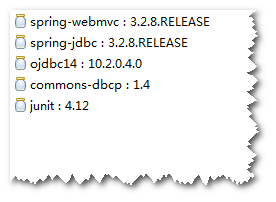
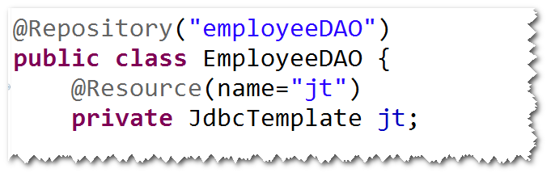

# 1. SpringJdbc
## (1)SpringJdbc是什么?
Spring对jdbc的封装。 
注：使用SpringJdbc访问数据库，代码更简洁。（比如不用考虑如何
获取连接与关闭连接等）。 
## (2)编程步骤
step1. 导包。 
spring-webmvc,spring-jdbc,ojdbc,dbcp,junit。 

step2.添加spring配置文件。 
step3.配置JdbcTemplate。 

注：JdbcTemplate对常见的一些数据库操作做了封装。 
step4.调用JdbcTemplate提供的方法来访问数据库。 

注：通常会将JdbcTemplate注入到DAO。 

	
