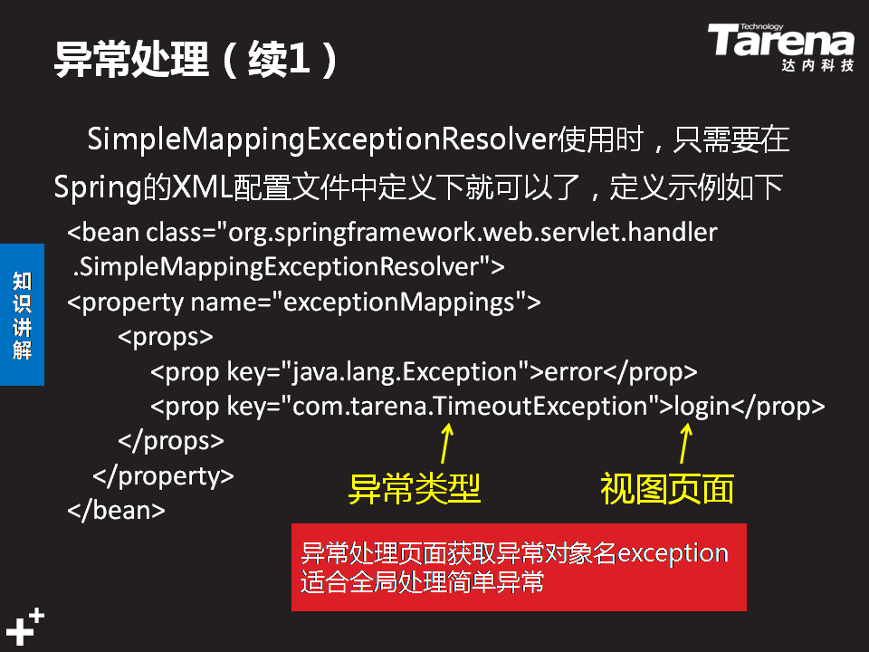

----------

   <!--处理系统异常-->
    <bean class="org.springframework.web.servlet.handler.SimpleMappingExceptionResolver">
        <property name="exceptionMappings">
    <props>        
    <prop key="java.lang.Exception">main/error</prop>
    </props>
    </property>
    </bean>  