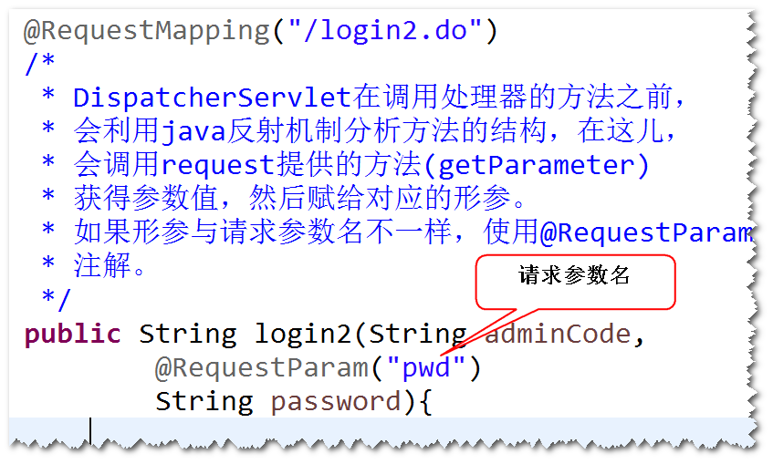

# 一、SpringMVC注解标签

----------
##1、@Controller
- 处理器
- 此注解代替Controller接口
##2、@RequestMapping
- 映射处理器
- 此注解代替HandlerMapping
- 使用此注解需要在spring配置文件中添加： <mvc:annotation-driven/>
##3、@RequestParam

##4、@ResponseBody
- Ajax + Spring MVC
- Spring MVC 提供了对Ajax工作方式的支持
- 
参见：

[点击查看](../SpringMVC+Ajax简介/SpringMVC+Ajax简介.html)