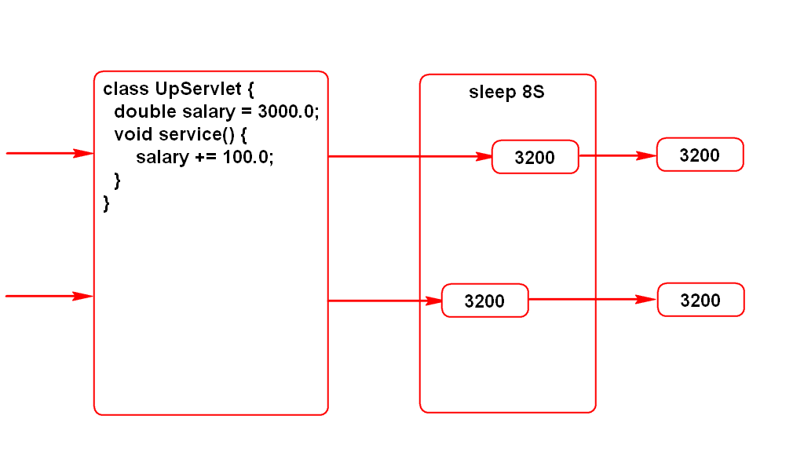

# 一.config和context
## 1.它们的作用(*)

## 2.它们的区别
- config和Servlet是1对1的关系，config中的数据只能给1个Servlet使用
- context和Servlet是1对多的关系，context中的数据所有Servlet共用
> 这种关系由Tomcat来保障

## 3.config使用场景
- 假设要开发一个网页游戏，当达到人数上限时要排队
- 开发登录功能LoginServlet，获取并判断最大在线人数maxOnline
- maxOnline是常量，且可以配置
- 该参数只需给登录功能使用，使用config读取即可

## 4.context使用场景
- 一个软件往往包含很多查询功能，通常都支持分页
- 分页功能的已知条件：页码page，每页显示行数size
- size是常量，并且需要可配
- 开发FindDogServlet,FindCatServlet，要支持分页
- 因为此参数被多个Servlet共用，使用context读取

## 5.context特殊用途
- 3、4场景中config和context读取的都是常量
- context对象还能够读写变量，这些变量可以被所有Servlet共用
- 统计网站流量：

# 二.Servlet线程安全问题

# 三.jsp
## 1.include指令

## 2.jsp原理

## 3.翻译的过程

## 4.jsp隐含(内置)对象
### 4.1什么是jsp隐含对象
- 可以直接在jsp上使用的对象

### 4.2有哪些隐含对象(面试题)
#### 1)request(*)
- HttpServletRequest

#### 2)response
- HttpServletResponse

#### 3)out
- JSPWriter
- 和PrintWriter一样

#### 4)config
- ServletConfig

#### 5)application
- ServletContext

#### 6)exception
- Throwable

#### 7)session(*)
- HttpSession

#### 8)page
- Object
- 值是this，指代当前的jsp
> 指代当前jsp所生成的那个Servlet的实例

#### 9)pageContext(*)
- PageContext
- 是jsp的环境，jsp的管理者
- 通过此对象可以获得其他8个隐含对象

### 4.3如何使用隐含对象
- <%String user = request.getParameter("user");%>
- <%=request.getParameter("user")%>

