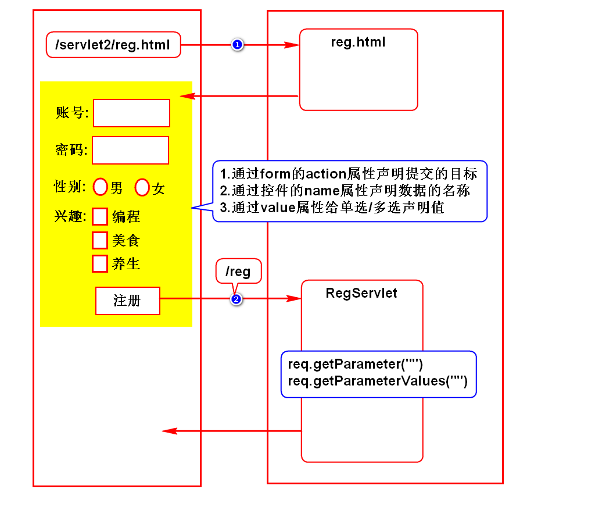
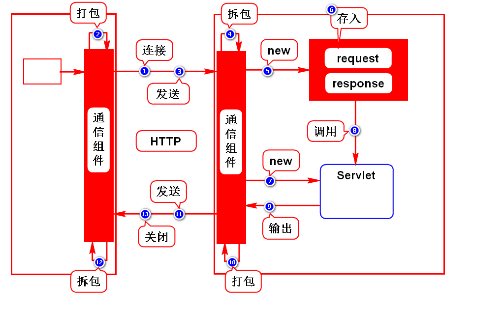
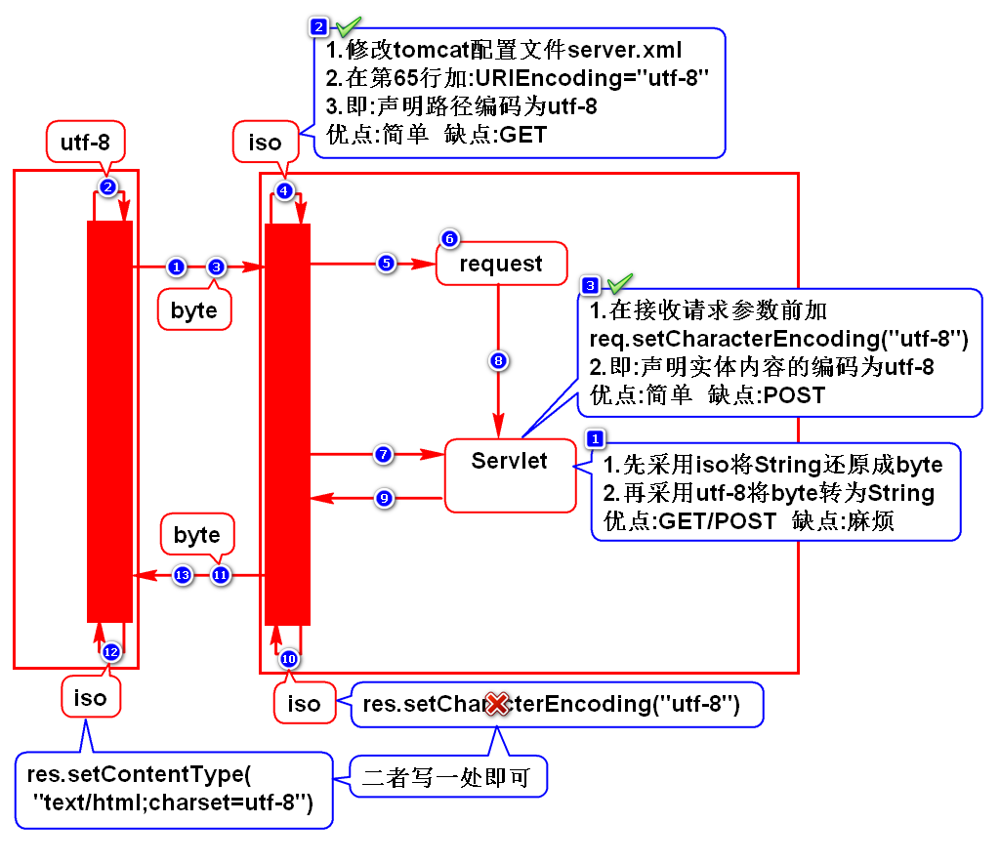
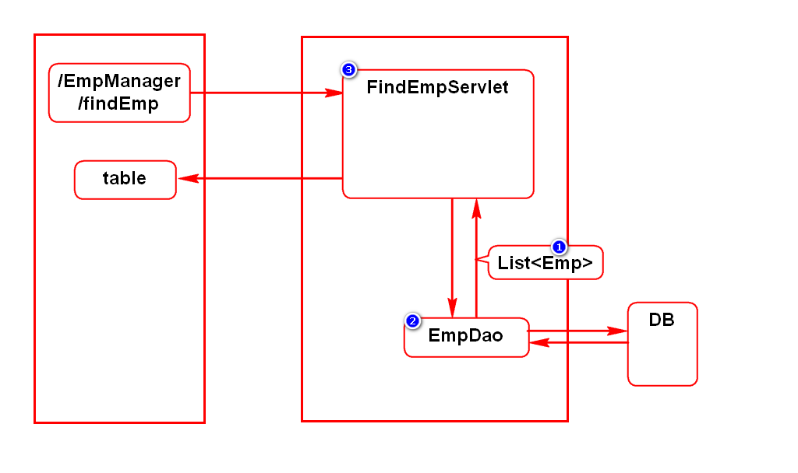

# 一.注册案例

# 二.Servlet运行原理

# 三.请求方式
## 1.什么是请求方式
- 就是浏览器向服务器发送数据的方案

## 2.有哪些请求方式
- 有很多请求方式，需要掌握的有2个：GET和POST

## 3.GET和POST的区别(面试题)
### 1)GET
- 采用路径传参(请求行)
- 参数在传递过程中可见，隐私性差
- 参数的大小受限
> 默认所有的请求都是GET请求

### 2)POST
- 采用实体内容传参
- 参数在传递过程中不可见，隐私性好
- 参数的大小不受限
> 在form上加method="POST"

## 4.使用时的建议
- 查询时采用GET请求(条件少、无需保密)
- 提交时采用POST请求(数据多、可能需保密)

# 四.中文乱码解决方案

# 五.员工查询案例

# 补充:什么是JavaBean？
- 满足如下规范的类：
- 位于包内
- 有默认构造器
- 实现序列化接口
- 通常有get/set方法

