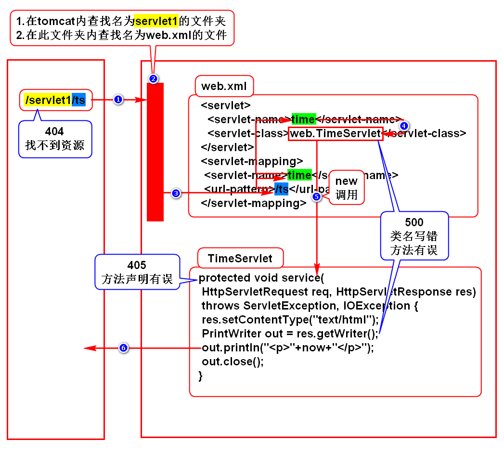

# 一.WEB项目的发展
## 1.发展规律
- 由单机向网络发展
- 由CS向BS发展

## 2.CS
- Client Server，即客户端服务器程序
- Client需要单独开发及安装

## 3.BS
- Browser Server，即浏览器服务器程序
- 使用浏览器充当客户端

# 二.Servlet介绍
## 1.服务器如何保存并返回一个网页?
### 1.1静态网页
- 谁看内容都一样
- 新闻、百科
- 服务器保存并返回一个HTML即可

### 1.2动态网页
- 每个人看到的结果有差异
- 微博、淘宝
- 服务器保存一个对象，用它来动态拼HTML
> 在Java中这个对象就是Servlet，它有相关的规范

## 2.Servlet的特点(*)
- 存储在服务器端
- 要满足sun的规范，满足规范的对象叫组件
- 它能够给浏览器拼动态资源(网页/图片/文件)
> 术语：处理HTTP协议

## 3.什么是Servlet?
- Servlet是sun推出的用来在服务器端处理HTTP协议的组件

# 三.服务器
## 1.名词
- Java服务器
- WEB服务器
- Java WEB服务器
- Servlet容器

## 2.本质
- 是一个软件
- 和浏览器相对应，是平等的关系

## 3.举例
- Tomcat(Apache)
- JBOSS
- WebLogic
- WebSphere

# 四.Tomcat使用方式
## 1.单独使用(系统上线时)
### 1)下载及安装
- apache官网
- doc.tedu.cn/tomcat
- 这是绿色版软件，解压缩即可用
> 学生机上已经下载并安装完成了

### 2)配置JAVA_HOME
- 学生机上已经配置好了

### 3)启动tomcat
#### Linux
- 打开/tomcat/bin,打开终端输入chmod +x *sh
- 打开/tomcat/bin,打开终端输入./startup.sh

#### windows
- 打开/tomcat/bin,双击startup.bat

### 4)访问tomcat
- 打开浏览器，输入
- http://localhost:8080
- 看到一只猫则代表成功

### 5)关闭tomcat
#### Linux
- 打开/tomcat/bin，打开终端输入./shutdown.sh

#### windows
- 打开/tomcat/bin，双击shutdown.bat

## 2.通过Eclipse调用(开发时)
### 1)操作步骤
- doc.tedu.cn/tomcat

### 2)重新配置时的注意事项
- 在server runtime界面，将tomcat选中并remove
- 在Eclipse左侧选择Servers项目，将其删除

# 五.Servlet开发步骤
## 1.创建WEB项目
- WEB项目必须具备标准的目录结构
- /webapp/WEB-INF/web.xml

## 2.导入JAVAEE的包
- 参考doc.tedu.cn/maven

## 3.开发Servlet
- 实现Servlet接口(继承于HttpServlet)
- 重写service()

## 4.配置Servlet
- 在web.xml中配置

## 5.部署项目
- 在Servers下选择tomcat
- 右键点击add and remove
- 从左侧将待部署项目移动到右侧
- 启动tomcat则完成部署
- 注意修改代码后要重新部署：publish
> 部署：拷贝的术语

## 6.访问Servlet
- http://IP:PORT/项目名/servlet访问路径

# 六.程序执行过程

# 七.HTTP协议
## 1.什么是HTTP协议
- 就是w3c制定的一个规范
- 规定了浏览器和服务器如何通信以及通信的数据格式

## 2.如何通信
- 建立连接
- 发送请求
- 返回响应
- 关闭连接

## 3.数据格式
### 1)请求数据
- 请求行：请求的基础信息
- 消息头：对实体内容的描述
- 实体内容：浏览器向服务器发送的业务数据

### 2)响应数据
- 状态行：响应的基础信息
- 消息头：对实体内容的描述
- 实体内容：服务器向浏览器发送的数据

## 4.需要我们处理的地方
### 1)不需要我们处理的地方
- 浏览器向服务器发送数据由浏览器自动实现
- 服务器向浏览器发送数据由服务器自动实现
- 浏览器发送的数据由浏览器自己组装
- 服务器发送的数据由服务器自己组装

### 2)需要我们处理的地方
- 请求的业务数据和响应返回的数据由我们提供
- 通过request处理请求数据
- 通过response处理响应数据
> 我们需要学会如何使用request和response

# 补充：导包失败怎么办？
- 将dependency那段代码从pom.xml中删除
- 将.m2文件夹下，刚刚导入失败的包删除
- 重新导包

