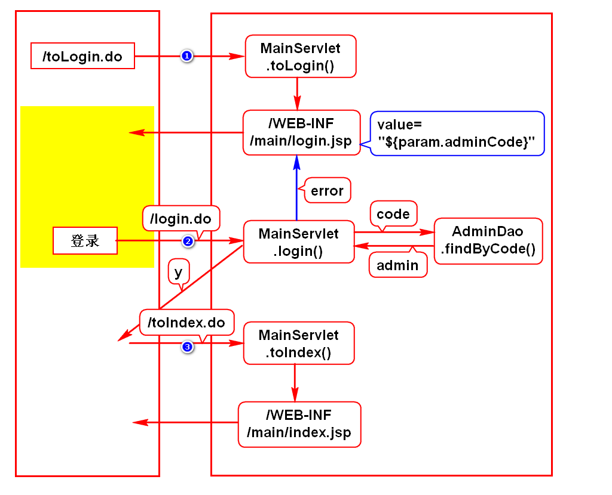
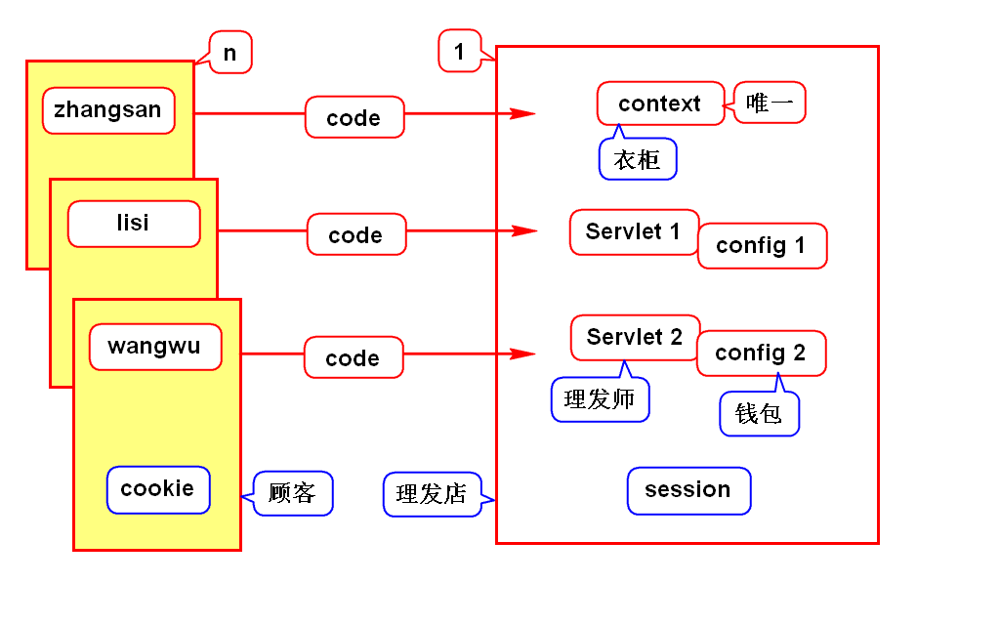
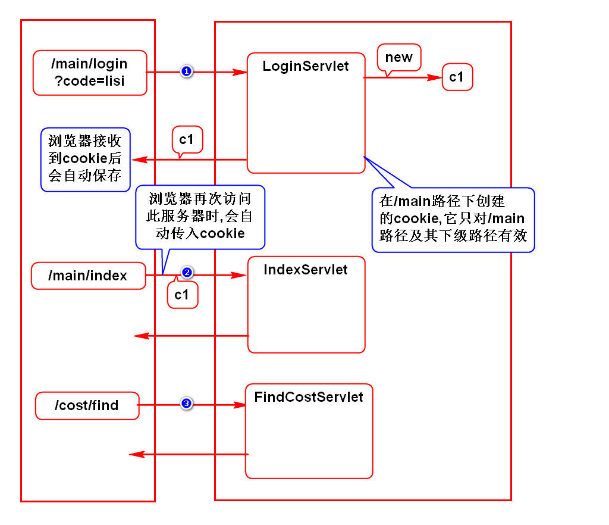
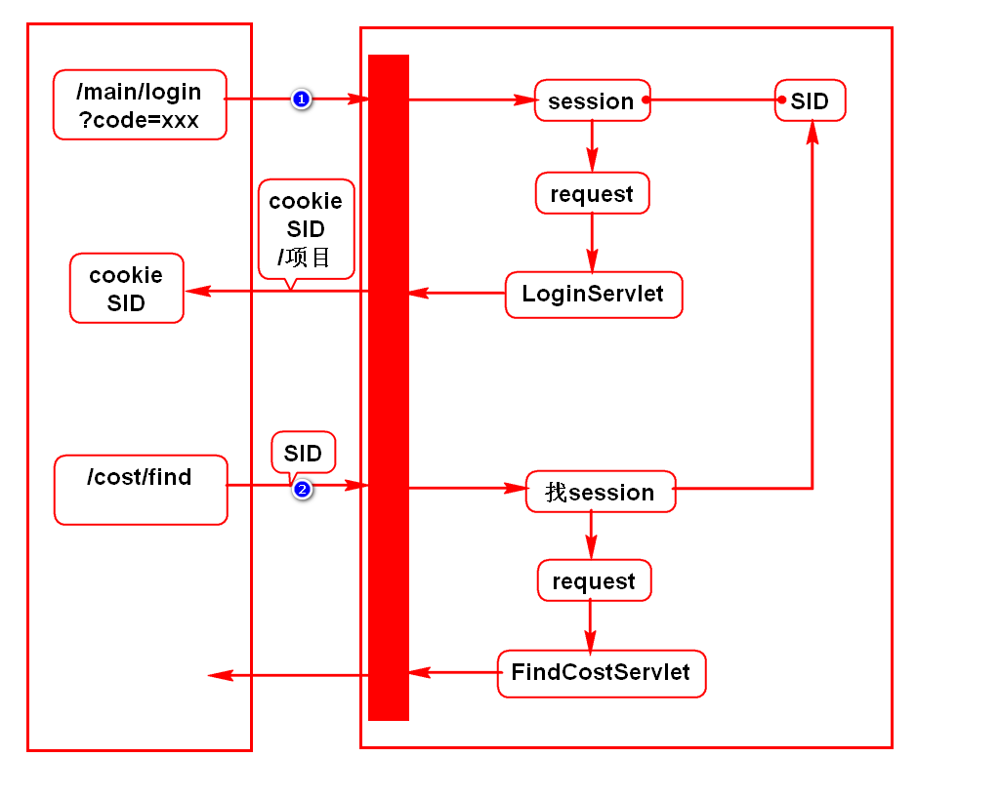
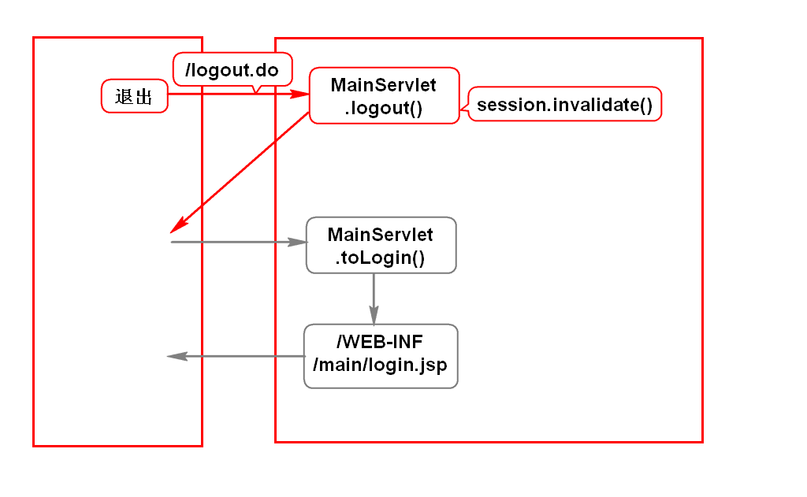

# 一.完善登录功能

# 二.cookie和session
## 1.业务场景
- 登录时要记录账号
- 后续查询、增加、修改等页面上显示此账号

## 2.错误的做法
### 1)request
- 登录、查询是不同的请求，使用不同的request
> 不同的请求无法通过request共享数据

### 2)config
- 可能一个Servlet处理一个请求
- 登录是一个Servlet,它对应一个config
- 查询是另一个Servlet,它对应另一个config
> 不同的Servlet无法通过config共享数据

### 3)context
- 浏览器和服务器是多对一的关系
- 每个浏览器传入的账号变量名都是code
- 服务器中每个项目内只有一个context
- 用唯一的对象存储多份同名数据有冲突

## 3.正确的做法(*)
- 使用cookie/session来存储这样的数据
- 多个请求可以共享此对象中的数据
- 多个Servlet可以共享此对象中的数据
- 服务器会给每个浏览器创建一份cookie/session
> 上述条件由Tomcat来保障

## 4.cookie和session的区别(面试题)
- cookie存储在浏览器上,服务器压力小,不安全
- session存储在服务器上,服务器压力大,安全

## 5.使用建议
- 重要数据保存到session内
- 其他数据保存到cookie内

# 三.cookie
## 1.案例

## 2.要点
### 1)基本语法
- 创建cookie: new Cookie(key,value)
- 发送cookie: response.addCookie(c)
- 获取cookie: request.getCookies()
- 读取cookie: c.getName()/c.getValue()

### 2)扩展内容
- 设置生存时间: setMaxAge(n)
- 保存中文: URLEncoder.encode()/URLDecorder.decode()
- 设置生效路径: c.setPath("")

# 四.session
## 1.案例

## 2.要点
### 1)基本语法
- 获取session: request.getSession()
- 存入数据: session.setAttribute(String,Object)
- 获取数据: session.getAttribute(String)
- 销毁session: session.invalidate()

### 2)扩展内容
- session超时: 在web.xml中进行配置
- 浏览器禁用cookie时: URL重写