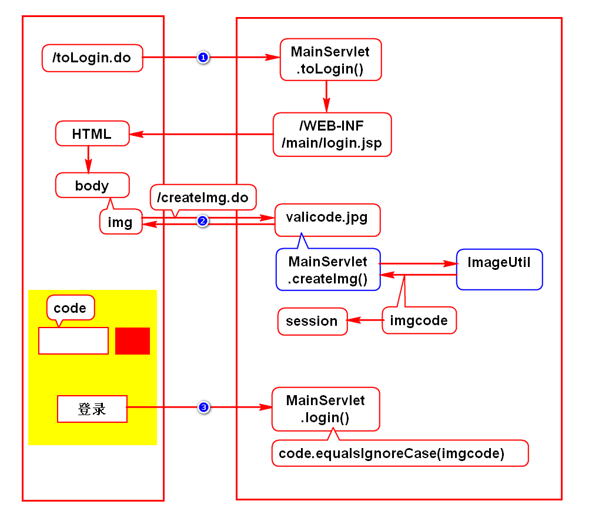
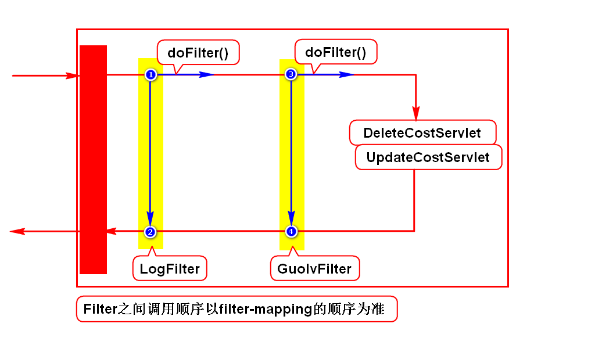
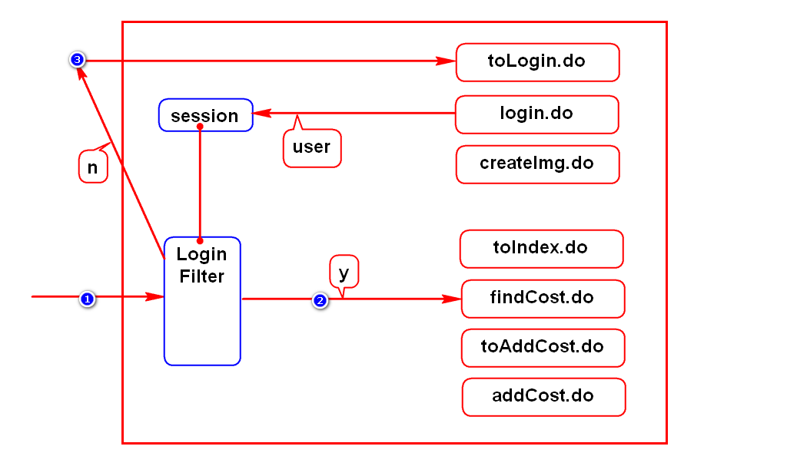
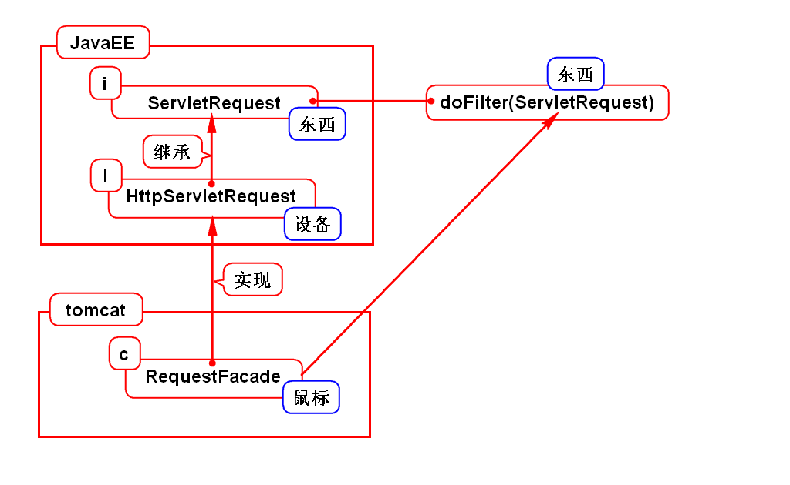

# 一.验证码

# 二.cookie和session的作用
## 1.通俗的理解(*)
- 存储在cookie或session对象中的数据,满足如下特征:
- 多个请求可以共享此对象内的数据
- 多个Servlet可以共享此对象内的数据
- 服务器自动给每个浏览器创建一组cookie,创建一个session
> cookie存储在浏览器上,session存储在服务器上

## 2.专业的理解
- HTTP协议是无状态协议,即服务器默认没有记住浏览器
- cookie和session就是用来管理这个状态的
> 状态:就是服务器记住浏览器的证据(数据)

# 三.过滤器(Filter)
## 1.什么是过滤器
- 过滤器对象可以处理项目中的公共业务
- 如: 登录检查、过滤敏感词、记录日志
> 公共业务: 多个请求都具备的要求

## 2.如何使用过滤器
- 写一个类,实现Filter接口
- 在web.xml中配置此类

## 3.小案例

## 4.NETCTOSS登录检查功能

## 5.参数转型问题

# 四.监听器
## 1.什么是监听器
- 用来监视事件发生的对象
- 当事件发生时该对象会通知服务器

## 2.监听的目标
### 1) request
- ServletRequestListener:监视request的创建与销毁
- ServletRequestAttributeListener:监视request中数据的变化

### 2) session
- HttpSessionListener:监视session的创建与销毁
- HttpSessionAttributeListener:监视session中数据的变化

### 3) context
- ServletContextListener:监视context的创建与销毁
- ServletContextAttributeListener:监视context中数据的变化

## 3.如何使用监听器
- 写一个类,实现对应的Listener接口
- 在web.xml中声明此类

