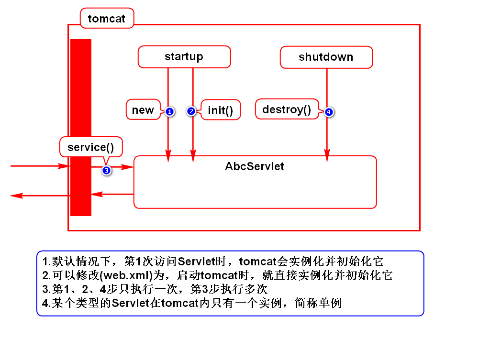

# 一.增加员工

# 二.重定向

# 三.访问路径
## 1.部署过程

## 2.如何获取访问路径
- 项目名:req.getContextPath()
- Servlet访问路径:req.getServletPath()
- URI:req.getRequestURI()
- URL:req.getRequestURL()

## 3.URI和URL的区别(面试题)
### 狭义的理解(Java WEB项目)
- URI:绝对路径
- URL:完整路径
> URL包含URI

### 广义的理解(任意WEB项目*)
- URI:资源的名字(刘苍松/苍老师/二蛋/cang#null)
- URL:资源的真名(刘苍松)
> URI包含URL

## 4.如何配置Servlet访问路径
### 1)精确匹配(/hello)
- 只有"/hello"这一个路径能访问此Servlet
- 此Servlet只能处理一个请求
> Servlet处理能力有限

### 2)通配符(/*)
- 所有的路径都能访问此Servlet
- 此Servlet能处理所有的请求
> Servlet处理一切请求

### 3)后缀(*.emp)
- 只有以"emp"为后缀的请求才能访问此Servlet
- 此Servlet能处理多个请求

## 5.如何使用一个Servlet处理多个请求

# 四.Servlet生命周期

