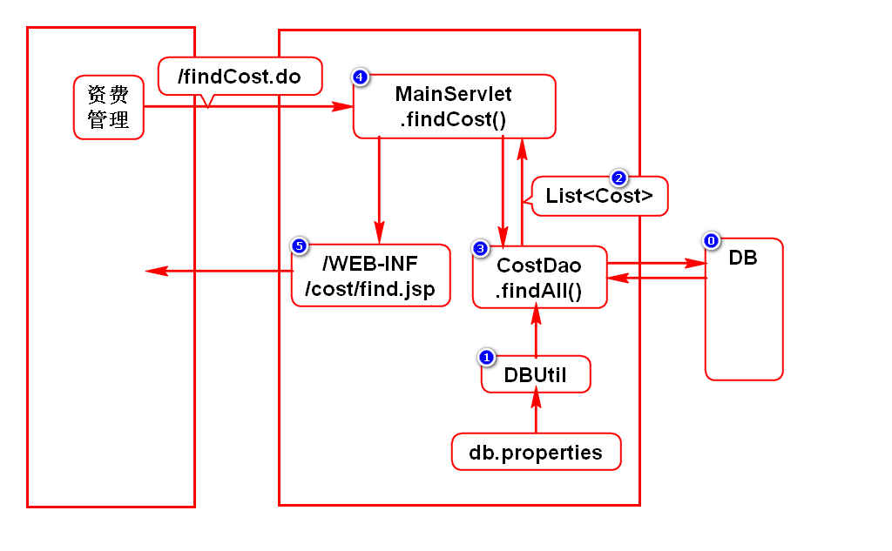
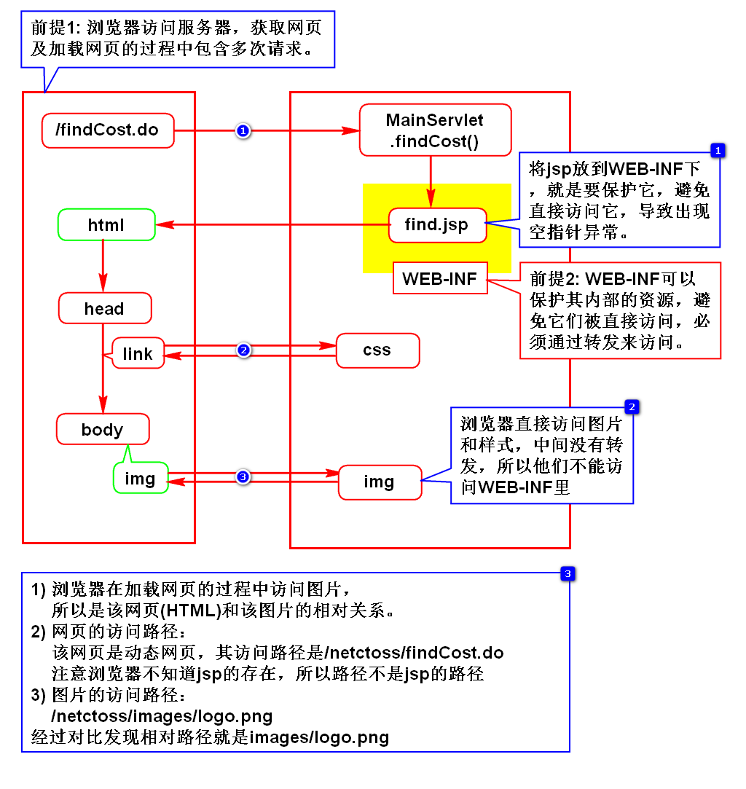

# 一.项目介绍
## 1.名称
- NETCTOSS
- C:China
- T:Telecom 电信
- O:Operation 运营
- S:Support 支持
- S:System 系统
> 中国电信运营支持系统-网络版

## 2.项目准备
### 1)创建项目
- netctoss

### 2)导包
- javaee: 搜javaee，选5
- jstl: 搜jstl，选1.2
- jdbc: 搜ojdbc，选10.2.0.4.0
- dbcp: 搜commons-dbcp，选1.4

## 3.开发思路(***)
### 1)需求
- 理解需求、明确需求
> 建议给需求人员复述自己对需求的理解

### 2)设计
- 根据需求做出设计(图、文)
- 将一个功能拆分成若干请求:想想这个功能包含哪些请求？
- 每个请求画出程序执行过程
- 给出每个过程的开发步骤

### 3)开发
- 按照设计逐个请求、逐个组件开发

# 二.资费查询
## 1.开发步骤

## 2.问题
### 1)jsp上如何格式化日期
- fmt.tld
- formatDate

### 2)目录/路径问题
- 为什么jsp要放在WEB-INF下
- 为什么图片/样式不放在WEB-INF下
- 为什么jsp上引用图片/样式不写../

