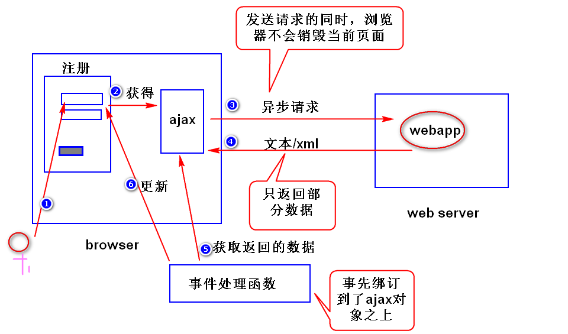
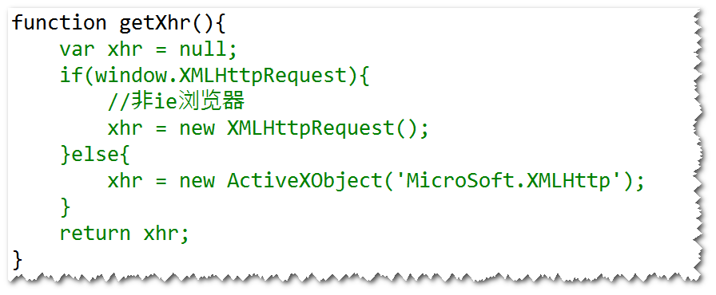
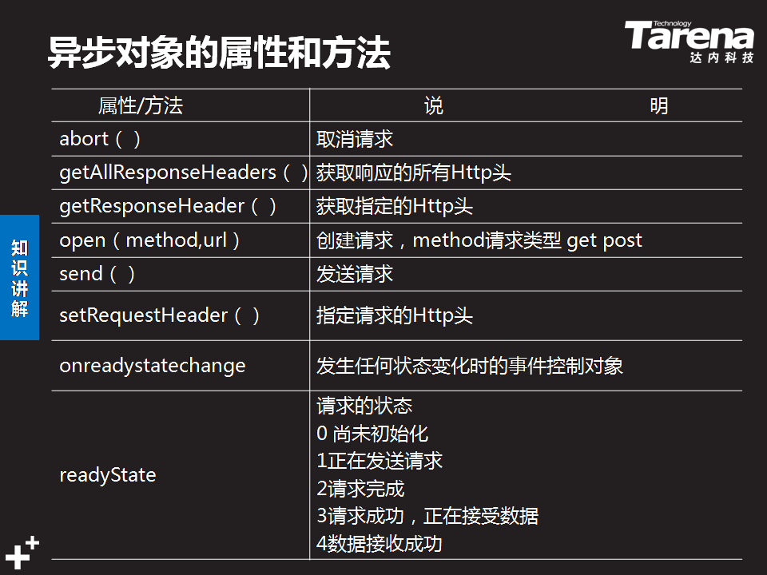
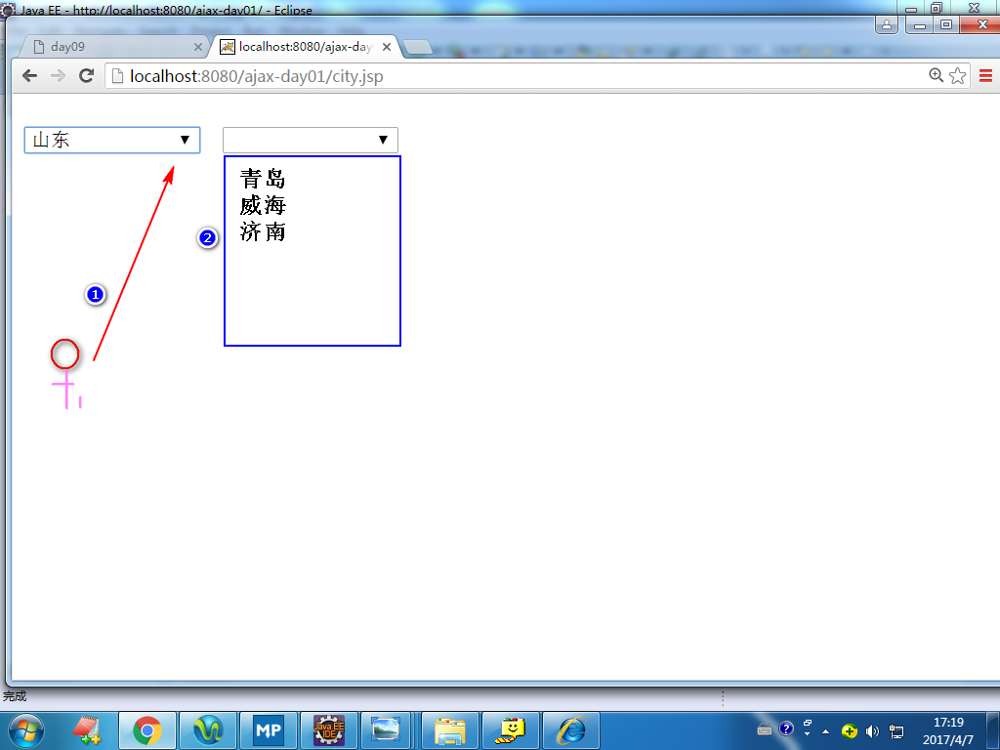

# 1. ajax (asynchronous javascript and xml)
## (1)ajax是什么?
是一种用来改善用户体验的技术。其本质是利用浏览器提供的一个
特殊对象(ajax对象，即XMLHttpRequest对象)向服务器发送异步
请求,服务器返回部分数据（通常不是一个完整的页面）。浏览器
利用这些数据对当前页面做局部更新。整个过程页面无刷新，不打断
用户的操作。 
注：异步请求指的是，当ajax对象发送请求时，浏览器不会销毁当前
页面，用户仍然可以对当前页面做其它的操作。 

## (2)如何获得ajax对象?

## (3)重要属性

## (4)编程步骤
step1. 获得ajax对象。比如: 
var xhr = getXhr();  
step2. 利用ajax对象发生请求。 

方式一：发送get请求  
	    xhr.open('get','check.do?adminCode=tom',true);  
    	xhr.onreadystatechange=f1;  
    	xhr.send(null);  
注： 
true:异步  
false:同步（发送请求时，浏览器会锁定当前页面，用户对当前页面不能
做任何操作）。 

方式二：发送post请求  
		xhr.open('post','check.do',true);
		xhr.setRequestHeader('content-type',
		'application/x-www-form-urlencoded');
		xhr.onreadystatechange = f1;
		xhr.send('adminCode=tom');
注:按照http协议的要求，如果发送的是post请求，必须添加content-type
消息头，默认情况下，ajax对象不会添加该消息头，所以需要调用
setRequestHeader方法。 

step3. 编写服务器端的程序。 
注：通常只需要返回部分的数据。 
step4. 编写事件处理函数。 
function f1(){   
	//先获得服务器返回的数据   
	if(xhr.readyState == 4 &&    
		xhr.status == 200){    
		//文本数据    
		var txt = xhr.responseText;  
		//更新页面   
		...
	}  
}   

## (5)缓存问题
### 什么是缓存问题?
使用ie浏览器提供的ajax对象发送get请求时，会比较请求地址是否
访问过，如果访问过了，则不再发送新的请求，而是显示之前缓存的
结果。 
### 如何解决?
在请求地址后面添加上随机数。 

练习：
	利用ajax技术实现级联下拉列表。

	
