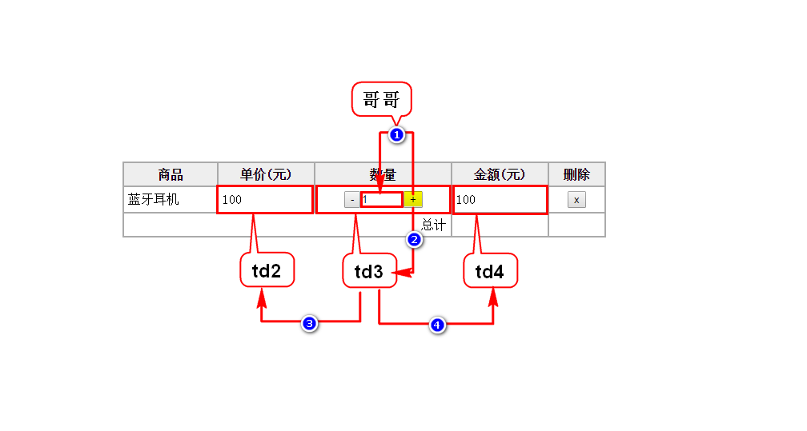
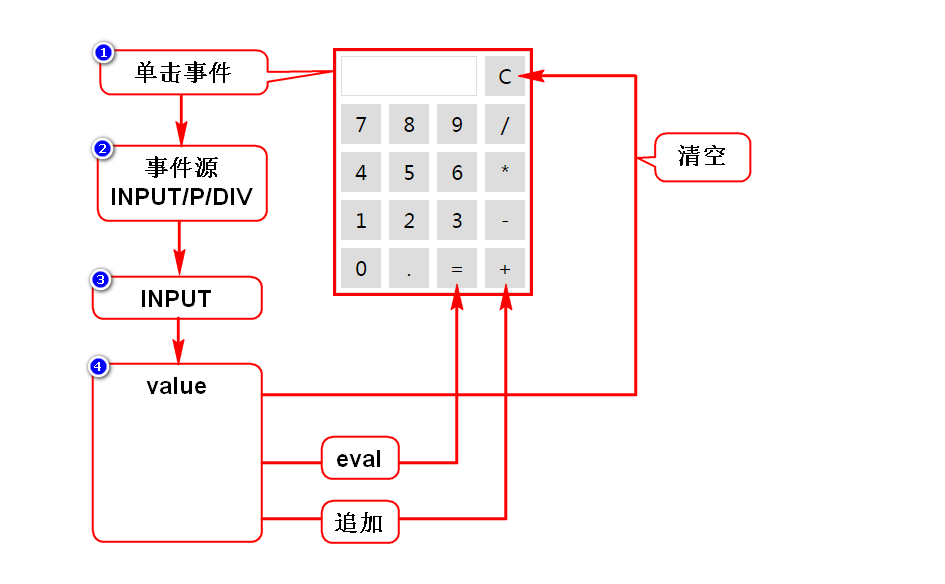

# 一.加法

# 二.自定义对象
## 1.定义的方式
### 1.1直接量
- {"name":"zhangsan","age":25}
- {}代表一个对象，内含多组键值对
- key通常是字符串，value是任意类型的数据
> 简单

### 1.2构造器(首字母大写的函数)
#### 1.2.1内置构造器
- 特定：Array,Date,RegExp,String,Function
- 通用：Object

#### 1.2.2自定义构造器
- 自定义一个函数，首字母大写
- 明确声明需传入的参数
- 将参数记录到此对象上

## 2.归纳
- 无论采用哪种方式，创建出来的对象本质都一样，都是Object
- 若创建的对象给别人使用，建议用1.2.2
- 若创建的对象给自己使用，建议使用1.1或1.2.1

# 三.事件
## 1.事件概述
### 1)什么是事件
- 就是用户的操作、动作
- 就是JS被调用的时机

### 2)事件的分类
- 鼠标事件
- 键盘事件
- 状态事件：当某条件达成时自动触发

## 2.事件定义
### 1)直接定义事件
- 直接在元素上写事件属性来定义事件
- 优点：直观
- 缺点：HTML和JS耦合度高

### 2)后(动态)绑定事件
- 在页面加载后，获取元素并给它增加事件
- 优点：HTML和JS耦合度低
- 缺点：不直观

## 3.事件对象
### 1)什么是事件对象
- 事件触发时，浏览器会创建一个对象，将事件相关信息封装到此对象内
- 包括：鼠标的坐标、键盘的按键等
- 总之事件对象内包含了事件相关的所有信息

### 2)如何获取事件对象
#### 直接定义事件时
- onclick="f1(event);"
- 函数f1增加参数接收此对象即可使用

#### 后绑定事件时
- 事件触发时，浏览器自动给调用的方法传入event
- 函数增加参数接收此对象即可使用

## 4.事件机制
### 4.1什么是事件冒泡机制
- 事件是由内向外传播的

### 4.2如何停止冒泡
- e.stopPropagation()
- e.cancelBubble = true
> 需要经过判断调用上述代码之一

### 4.3冒泡机制的作用
- 简化事件的定义

### 4.4事件源
- 简化事件定义时，需知道事件源
- 事件源：事件发生的具体位置/源头
- e.srcElement || e.target

